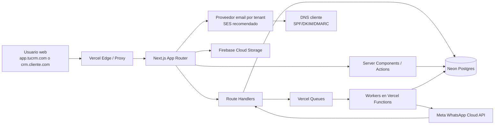
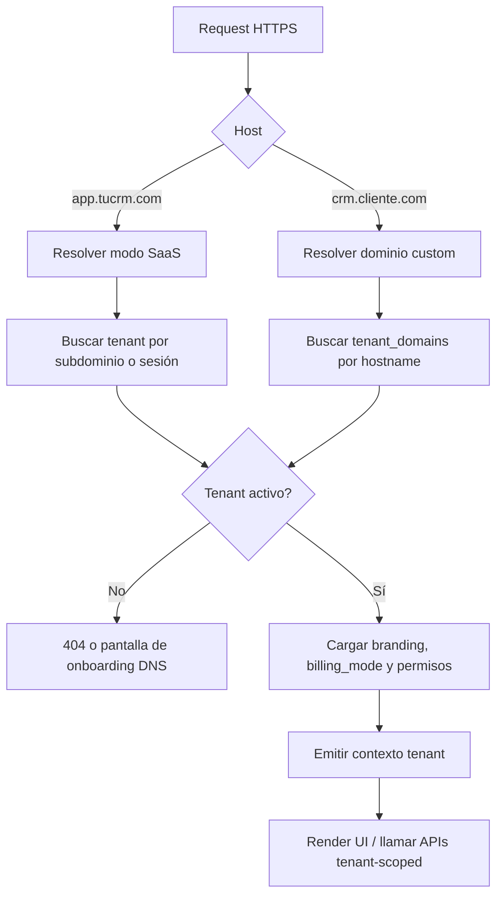
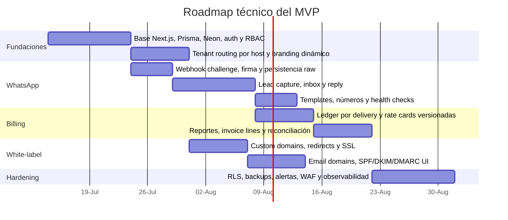

# CRM SaaS con white‑label real y WhatsApp oficial de Meta

## Resumen ejecutivo

La arquitectura más sólida para tu caso es un **solo código base multi‑tenant** en **Next.js fullstack**, desplegado en **Vercel**, con **Neon Postgres + Prisma** como núcleo transaccional, **Vercel Queues** para trabajo asíncrono durable, y **Firebase Cloud Storage** solo para adjuntos y media cuando realmente lo necesites. Ese diseño permite operar dos modelos comerciales sin separar repositorios: **SaaS público** en `app.tucrm.com` con plan mensual + consumo WhatsApp, y **CRM privado white‑label** en `crm.cliente.com` con marca, dominio, correos y facturación solo por costo WhatsApp. Vercel soporta plataformas multi‑tenant con **dominios personalizados**, **wildcards**, y **SSL automático** para dominios verificados; Pro ya permite dominios personalizados a gran escala, mientras que funciones como **custom SSL subido por ti** y **multi‑tenant preview URLs** quedan reservadas a Enterprise. citeturn20search22turn21view2turn21view3turn35view0

Para WhatsApp, el camino correcto es usar la **WhatsApp Business Platform / Cloud API oficial de Meta** con **webhooks** para mensajes y estados, y persistir una **bitácora de costos por mensaje entregado**. Meta cobra en el modelo actual **por mensaje entregado**, no por mensaje enviado, y el precio depende del **mercado del destinatario** y de la **categoría del mensaje**. Hoy, Meta publica cuatro categorías principales: **marketing, utility, authentication y service**; además, el sistema debe nacer con **versionado por fecha efectiva** porque Meta ya publicó cambios de tarifas vigentes desde **1 de julio de 2026** y también anunció cambios de cobro a partir del **1 de octubre de 2026** para mensajes no plantilla, por lo que sería un error duro “quemar” reglas de precios en código. citeturn13view0turn17search0turn31search3turn31search5turn32search0turn27search7

Para el white‑label “real”, la clave no es revender el sistema, sino que **cada tenant resuelva por host**, cargue su propia **marca**, responda desde su propio **dominio**, emita correos con su propio **From**, y oculte completamente la superficie SaaS cuando entre por su dominio privado. Eso implica: tabla de dominios por tenant, resolución por `Host`, branding dinámico, emails con **DKIM/SPF/DMARC** por dominio del cliente, redirecciones canónicas para que no aparezca el dominio SaaS si el tenant tiene dominio propio, y un modelo de permisos donde el panel público de plataforma solo exista en `app.tucrm.com`. Vercel documenta el alta programática de dominios, la verificación por TXT cuando haga falta, los redirects entre apex y `www`, y la emisión automática de certificados; AWS SES documenta la verificación de dominios, Easy DKIM y custom MAIL FROM para SPF. citeturn35view0turn20search12turn21view2turn20search15turn8search3turn8search6turn8search9turn8search21

Tu MVP debe enfocarse en cinco flujos: **captura automática de lead desde WhatsApp**, **inbox omnicanal centrado en WhatsApp**, **respuesta desde el CRM**, **pipeline y asignación**, y **facturación transparente del costo Meta**. El CRM debe crear o actualizar contacto y lead desde mensajes entrantes, abrir un hilo de conversación, permitir respuesta del agente, registrar estados de envío/entrega/lectura, y exponer un módulo de costos donde el cliente vea, como mínimo, **mensajes entregados**, **categoría**, **mercado/currency aplicada**, **costo Meta estimado**, **ajustes por volumen** y **reconciliación**. Meta expone analíticas de precios con `pricing_analytics`, y sus webhooks de estado incluyen metadatos de pricing; además, Meta ya indica que `billable` será deprecado y que conviene usar `pricing.type` y `pricing.category`. citeturn26search1turn26search6turn27search0turn27search1turn26search0

El plan de acción listo para desarrollo, en orden, es este: **resolver tenant por dominio**, **montar auth y RBAC**, **implementar webhook WhatsApp + idempotencia**, **persistir lead/contact/conversation/message**, **habilitar reply desde CRM**, **agregar ledger de costos WhatsApp**, **activar branding + dominios personalizados**, **sumar email white‑label**, y recién después pasar a automatizaciones, reporting avanzado y hardening enterprise. Con esa secuencia llegas a un MVP comercializable sin hipotecar el camino a escalar. citeturn29search1turn29search4turn21view0turn30search2turn19search1turn19search4

## Arquitectura técnica completa

La recomendación central es un **modelo single‑deployment, multi‑tenant**. En Vercel, el request entra por el edge/networking de la plataforma; un **`proxy.ts`** de Next.js 16 resuelve el tenant por `Host`, consulta el dominio en base de datos y reescribe hacia la app interna con contexto de tenant. Después, los **Route Handlers** de Next.js reciben tanto tráfico de UI como webhooks de Meta. Neon aporta Postgres serverless con **pooling basado en pgBouncer**, autoscaling y branching útil para previews; Prisma se mantiene como el ORM y la capa de migraciones. Para tareas que no deben bloquear la respuesta —por ejemplo, procesar adjuntos, sincronizar plantillas, recalcular costos, reintentos o reconciliaciones— conviene usar **Vercel Queues**; para trabajo mínimo post‑response puede usarse `after()`, pero el procesamiento crítico de mensajes y facturación debe ir por cola durable. citeturn18search18turn29search1turn29search4turn21view0turn33view0turn12view2turn18search21

En dominios, necesitas soportar dos patrones simultáneos: **wildcard subdomains** como `cliente.app.tucrm.com` para onboarding rápido, y **custom domains** como `crm.cliente.com` para white‑label total. Vercel documenta ambos: para wildcard SSL exige usar **nameservers de Vercel**; para custom domains permite alta programática con el SDK, verificación por TXT cuando el dominio ya está usado en Vercel y certificados SSL automáticos una vez propagado DNS. En Pro los custom domains son efectivamente ilimitados por proyecto con soft limit operativo alto, lo suficiente para un SaaS estándar; Enterprise solo hace falta si luego quieres **custom SSL propio** o **preview URLs por tenant**. citeturn35view0turn20search16turn21view2turn21view3

La ruta de mensajes de WhatsApp debe ser completamente asíncrona. Los mensajes entrantes llegan desde la Cloud API a tu endpoint de webhook, se validan con `hub.verify_token` en el challenge inicial y con la firma `X-Hub-Signature-256` en POST, se guardan crudos para auditoría, se normalizan, y se publican a una cola `whatsapp.inbound`. Un worker durable toma ese evento, hace **upsert** de contacto por `wa_id` o E.164, crea o reabre lead, persiste conversación y mensaje, y dispara notificaciones internas. Las respuestas de agentes viajan por una cola `whatsapp.outbound`, se envían al endpoint de mensajes de Cloud API, y sus estados posteriores se reconcilian vía webhook. Esta separación protege la UX, reduce fallos por timeouts y evita doble procesamiento. citeturn15search5turn16search1turn16search0turn14search30turn26search13turn21view0turn29search1



El diagrama anterior refleja una infraestructura que coincide con capacidades oficiales: Next.js usa Route Handlers para endpoints HTTP; Vercel soporta plataformas multi‑tenant, dominios personalizados y SSL automático; Neon ofrece pooling y branching; y Vercel Queues se factura por operación y usa Functions para consumidores push. Cloud Storage for Firebase existe explícitamente para contenido generado por usuario y se puede limitar a adjuntos, de modo que el core de datos siga en Postgres. citeturn29search1turn20search22turn21view2turn21view3turn33view0turn21view0turn7search0

El mejor patrón de seguridad para esta misma arquitectura es **aislamiento lógico fuerte por tenant** con `tenant_id` en todas las tablas de negocio y, además, **RLS en Postgres** como segunda barrera. Neon documenta explícitamente que RLS es una capa adicional más allá de la lógica de aplicación. En Vercel, guarda secretos solo como environment variables o sensitive environment variables; ambas están cifradas en reposo, y las sensibles quedan no legibles tras su creación. Para proteger la superficie web, Vercel Firewall/WAF añade DDoS mitigation de plataforma y reglas WAF; eso es suficiente para un MVP serio si además verificas webhook signatures y restringes operaciones administrativas por rol. citeturn30search2turn19search1turn19search4turn19search7turn19search0



Este flujo host‑first es lo que hace posible que el producto “se vea propio” para el cliente privado. Además, Vercel recomienda redirigir entre apex y `www` y evitar contenido duplicado cuando coexistiera subdominio SaaS y dominio custom del mismo tenant; para el white‑label severo conviene redirigir siempre al dominio de marca del cliente cuando exista. citeturn35view0turn20search15

## Esquema de base de datos y modelos Prisma

La estrategia de datos debe ser **tenant‑scoped por fila**, no por esquema y no por base por defecto. Con Prisma y Postgres, esto se traduce en tres reglas: todo recurso de negocio tiene `tenantId`; toda unicidad relevante se vuelve **compuesta por tenant**; y toda consulta aplicativa y todo índice de lectura frecuente arrancan por `tenantId`. Prisma soporta exactamente las piezas que te convienen aquí: `@@id`, `@@unique`, `@@index` y relaciones explícitas para modelar integridad relacional y unicidad compuesta. citeturn6search0turn6search1turn6search2turn6search17

El esquema mínimo serio para tu producto debe incluir estas entidades: `tenants`, `tenant_domains`, `tenant_branding`, `tenant_billing_profiles`, `users`, `memberships`, `contacts`, `leads`, `companies`, `conversations`, `messages`, `pipelines`, `pipeline_stages`, `lead_stage_history`, `assignments`, `whatsapp_accounts`, `whatsapp_phone_numbers`, `whatsapp_templates`, `whatsapp_webhook_events`, `whatsapp_message_statuses`, `whatsapp_rate_cards`, `usage_ledgers`, `invoices`, `invoice_lines`, `files`, `notes`, `tasks`, `audit_logs`, `email_domains`, `dns_onboarding_jobs` y, si quieres automatización desde el arranque, `automation_rules` y `automation_runs`. Esa malla cubre CRM, WhatsApp, white‑label y facturación sin tener que reescribir el core en la fase dos. La justificación técnica para insistir en índices compuestos y unicidad compuesta es que Prisma y Postgres los soportan de forma nativa y ese patrón evita colisiones entre tenants. citeturn6search0turn6search1turn6search2turn30search2

A nivel de campos, la norma debe ser consistente: todas las tablas mutables con `createdAt`, `updatedAt`, `deletedAt` opcional, `createdByUserId` opcional, `updatedByUserId` opcional, `version` entero para concurrencia optimista, y `tenantId` obligatorio salvo tablas puramente de plataforma. Para búsquedas rápidas, indexa al menos: `(tenant_id, status)`, `(tenant_id, updated_at desc)`, `(tenant_id, assignee_user_id)`, `(tenant_id, external_id)`, `(tenant_id, normalized_phone)`, `(tenant_id, domain)` y `(tenant_id, invoice_period_start, invoice_period_end)`. En mensajes, además, necesitas unicidad por `meta_message_id` o por `(tenant_id, whatsapp_phone_number_id, meta_message_id)` si quieres blindar duplicados por webhook/retry. Prisma documenta las opciones de índices y constraints; Neon documenta RLS como barrera adicional sobre las mismas tablas. citeturn6search0turn6search2turn30search2

```prisma
model Tenant {
  id               String   @id @default(cuid())
  slug             String   @unique
  name             String
  mode             TenantMode
  billingMode      TenantBillingMode
  status           TenantStatus @default(ACTIVE)
  timezone         String?  @default("UTC")
  locale           String?  @default("es-419")
  planCode         String?
  planPriceMonthly Decimal? @db.Decimal(10,2)
  createdAt        DateTime @default(now())
  updatedAt        DateTime @updatedAt

  domains          TenantDomain[]
  branding         TenantBranding?
  members          Membership[]
  contacts         Contact[]
  leads            Lead[]
  conversations    Conversation[]
  pipelines        Pipeline[]
  whatsappAccounts WhatsappAccount[]
  usageLedgers     UsageLedger[]
  invoices         Invoice[]

  @@index([status, createdAt])
}

model TenantDomain {
  id             String   @id @default(cuid())
  tenantId       String
  host           String
  kind           DomainKind
  isPrimary      Boolean  @default(false)
  verifiedAt     DateTime?
  sslStatus      String?
  dnsTarget      String?
  redirectToHost String?
  createdAt      DateTime @default(now())
  updatedAt      DateTime @updatedAt

  tenant Tenant @relation(fields: [tenantId], references: [id], onDelete: Cascade)

  @@unique([tenantId, host])
  @@index([host])
  @@index([tenantId, isPrimary])
}

model TenantBranding {
  id                 String   @id @default(cuid())
  tenantId           String   @unique
  appName            String
  logoUrl            String?
  faviconUrl         String?
  primaryColor       String?
  secondaryColor     String?
  supportEmail       String?
  fromName           String?
  emailDomain        String?
  customCss          String?
  createdAt          DateTime @default(now())
  updatedAt          DateTime @updatedAt

  tenant Tenant @relation(fields: [tenantId], references: [id], onDelete: Cascade)
}

model User {
  id             String   @id @default(cuid())
  email          String   @unique
  passwordHash   String?
  fullName       String?
  avatarUrl      String?
  status         UserStatus @default(ACTIVE)
  createdAt      DateTime @default(now())
  updatedAt      DateTime @updatedAt

  memberships    Membership[]
}

model Membership {
  id             String   @id @default(cuid())
  tenantId       String
  userId         String
  role           TenantRole
  isOwner        Boolean  @default(false)
  createdAt      DateTime @default(now())
  updatedAt      DateTime @updatedAt

  tenant Tenant @relation(fields: [tenantId], references: [id], onDelete: Cascade)
  user   User   @relation(fields: [userId], references: [id], onDelete: Cascade)

  @@unique([tenantId, userId])
  @@index([tenantId, role])
}

model Contact {
  id                 String   @id @default(cuid())
  tenantId           String
  companyId          String?
  firstName          String?
  lastName           String?
  fullName           String?
  email              String?
  phoneE164          String?
  whatsappWaId       String?
  normalizedPhone    String?
  source             String?
  tags               String[]
  createdAt          DateTime @default(now())
  updatedAt          DateTime @updatedAt
  version            Int      @default(1)

  tenant Tenant @relation(fields: [tenantId], references: [id], onDelete: Cascade)
  leads  Lead[]
  conversations Conversation[]

  @@index([tenantId, updatedAt])
  @@unique([tenantId, whatsappWaId])
  @@unique([tenantId, normalizedPhone])
  @@unique([tenantId, email])
}

model Lead {
  id                 String   @id @default(cuid())
  tenantId           String
  contactId          String
  pipelineId         String?
  stageId            String?
  ownerUserId        String?
  sourceChannel      LeadSourceChannel
  status             LeadStatus @default(OPEN)
  score              Int?
  firstInboundAt     DateTime?
  lastInboundAt      DateTime?
  lastOutboundAt     DateTime?
  createdAt          DateTime @default(now())
  updatedAt          DateTime @updatedAt
  version            Int      @default(1)

  tenant   Tenant @relation(fields: [tenantId], references: [id], onDelete: Cascade)
  contact  Contact @relation(fields: [contactId], references: [id], onDelete: Cascade)
  pipeline Pipeline? @relation(fields: [pipelineId], references: [id])
  stage    PipelineStage? @relation(fields: [stageId], references: [id])

  @@index([tenantId, status, updatedAt])
  @@index([tenantId, ownerUserId, updatedAt])
  @@index([tenantId, pipelineId, stageId])
}

model Conversation {
  id                      String   @id @default(cuid())
  tenantId                String
  contactId               String
  leadId                  String?
  channel                 ChannelType
  status                  ConversationStatus @default(OPEN)
  assigneeUserId          String?
  whatsappPhoneNumberId   String?
  lastMessageAt           DateTime?
  createdAt               DateTime @default(now())
  updatedAt               DateTime @updatedAt
  version                 Int      @default(1)

  tenant   Tenant  @relation(fields: [tenantId], references: [id], onDelete: Cascade)
  contact  Contact @relation(fields: [contactId], references: [id], onDelete: Cascade)
  lead     Lead?   @relation(fields: [leadId], references: [id])
  messages Message[]

  @@index([tenantId, channel, status, lastMessageAt])
  @@index([tenantId, assigneeUserId, lastMessageAt])
}

model Message {
  id                      String   @id @default(cuid())
  tenantId                String
  conversationId          String
  direction               MessageDirection
  kind                    MessageKind
  bodyText                String?
  mediaUrl                String?
  mediaMimeType           String?
  metaMessageId           String?
  externalStatus          String?
  pricingCategory         String?
  pricingType             String?
  billable                Boolean?
  currency                String?
  estimatedMetaCost       Decimal? @db.Decimal(12,6)
  recipientCountry        String?
  deliveredAt             DateTime?
  readAt                  DateTime?
  failedAt                DateTime?
  rawPayload              Json?
  createdAt               DateTime @default(now())
  updatedAt               DateTime @updatedAt

  tenant       Tenant       @relation(fields: [tenantId], references: [id], onDelete: Cascade)
  conversation Conversation @relation(fields: [conversationId], references: [id], onDelete: Cascade)

  @@unique([tenantId, metaMessageId])
  @@index([tenantId, conversationId, createdAt])
  @@index([tenantId, direction, createdAt])
  @@index([tenantId, pricingCategory, deliveredAt])
}

model WhatsappAccount {
  id                    String   @id @default(cuid())
  tenantId              String
  wabaId                String
  accessTokenRef        String
  tokenIssuedAt         DateTime?
  tokenExpiresAt        DateTime?
  onboardingMode        String
  createdAt             DateTime @default(now())
  updatedAt             DateTime @updatedAt

  tenant Tenant @relation(fields: [tenantId], references: [id], onDelete: Cascade)
  phoneNumbers WhatsappPhoneNumber[]

  @@unique([tenantId, wabaId])
}

model WhatsappPhoneNumber {
  id                    String   @id @default(cuid())
  tenantId              String
  whatsappAccountId     String
  phoneNumberId         String
  displayPhoneNumber    String
  verifiedName          String?
  qualityRating         String?
  messagingLimitTier    String?
  throughputTier        String?
  status                String?
  createdAt             DateTime @default(now())
  updatedAt             DateTime @updatedAt

  tenant          Tenant          @relation(fields: [tenantId], references: [id], onDelete: Cascade)
  whatsappAccount WhatsappAccount @relation(fields: [whatsappAccountId], references: [id], onDelete: Cascade)

  @@unique([tenantId, phoneNumberId])
  @@index([tenantId, status])
}

model UsageLedger {
  id                    String   @id @default(cuid())
  tenantId              String
  source                UsageSource
  usageDate             DateTime
  externalRef           String?
  category              String
  countryCode           String?
  currency              String
  quantity              Int
  unitCost              Decimal  @db.Decimal(12,6)
  totalCost             Decimal  @db.Decimal(12,6)
  billable              Boolean  @default(true)
  rawData               Json?
  createdAt             DateTime @default(now())

  tenant Tenant @relation(fields: [tenantId], references: [id], onDelete: Cascade)

  @@index([tenantId, usageDate])
  @@index([tenantId, source, usageDate])
  @@unique([tenantId, source, externalRef])
}

model Invoice {
  id                    String   @id @default(cuid())
  tenantId              String
  invoiceNumber         String
  periodStart           DateTime
  periodEnd             DateTime
  currency              String
  subtotal              Decimal  @db.Decimal(12,2)
  metaWhatsAppCost      Decimal  @db.Decimal(12,2)
  platformFee           Decimal  @db.Decimal(12,2)
  taxes                 Decimal  @db.Decimal(12,2)
  total                 Decimal  @db.Decimal(12,2)
  status                InvoiceStatus @default(DRAFT)
  createdAt             DateTime @default(now())
  updatedAt             DateTime @updatedAt

  tenant Tenant @relation(fields: [tenantId], references: [id], onDelete: Cascade)

  @@unique([tenantId, invoiceNumber])
  @@index([tenantId, periodStart, periodEnd])
}
```

Ese bloque no pretende listar todas las tablas auxiliarmente auditables, pero sí fija el patrón. En SQL, yo agregaría RLS desde el día uno sobre tablas sensibles como `contacts`, `leads`, `conversations`, `messages`, `usage_ledger` e `invoices`. Neon explica que RLS agrega una capa real más allá de la lógica de aplicación, exactamente lo que necesitas en un SaaS multi‑tenant con white‑label. citeturn30search2turn30search0

```sql
ALTER TABLE leads ENABLE ROW LEVEL SECURITY;

CREATE POLICY tenant_isolation_leads
ON leads
FOR ALL
USING (tenant_id = current_setting('app.tenant_id', true)::uuid)
WITH CHECK (tenant_id = current_setting('app.tenant_id', true)::uuid);

ALTER TABLE conversations ENABLE ROW LEVEL SECURITY;

CREATE POLICY tenant_isolation_conversations
ON conversations
FOR ALL
USING (tenant_id = current_setting('app.tenant_id', true)::uuid)
WITH CHECK (tenant_id = current_setting('app.tenant_id', true)::uuid);
```

El punto importante aquí es operativo: Prisma no reemplaza el aislamiento multi‑tenant; solo lo modela. El request debe resolver tenant por host/sesión, abrir transacción, setear el contexto de tenant y ejecutar toda mutación dentro de ese alcance. Con eso consigues una superficie compatible con SaaS público y con white‑label privado sin duplicar tablas ni despliegues. citeturn29search1turn30search2

## Diseño del MVP, páginas y endpoints

El MVP debe centrarse en resultados comerciales visibles y no en “completitud CRM”. La secuencia correcta es: **captura automática**, **inbox**, **respuesta**, **asignación**, **pipeline básico**, **branding/dominios**, y **facturación WhatsApp**. Todo lo demás —automatizaciones complejas, reportes avanzados, IA, omnicanalidad completa— puede esperar. Esto encaja con la naturaleza de Next.js App Router, donde Route Handlers son adecuados para APIs y webhooks, y con una arquitectura Vercel + Queues + Neon que ya soporta preview branching y despliegues rápidos. citeturn29search1turn29search4turn12view2

Las páginas mínimas recomendadas son estas:

| Superficie | Ruta | Objetivo |
|---|---|---|
| Landing SaaS | `/` en `app.tucrm.com` | Marketing del producto y signup SaaS |
| Login | `/login` | Acceso por tenant |
| Dashboard | `/app` | KPIs de leads, inbox y costos WhatsApp |
| Inbox | `/app/inbox` | Lista de conversaciones y respuesta |
| Conversación | `/app/inbox/[conversationId]` | Timeline, adjuntos, estados y costo |
| Leads | `/app/leads` | Tabla de leads con filtros |
| Lead detalle | `/app/leads/[leadId]` | Perfil, actividad, notas, asignación |
| Pipeline | `/app/pipeline` | Kanban por etapas |
| WhatsApp settings | `/app/settings/whatsapp` | Números, plantillas, webhook health |
| Branding | `/app/settings/branding` | Logo, colores, nombre de app |
| Dominios | `/app/settings/domains` | Alta, verificación, DNS instructions |
| Email domain | `/app/settings/email` | Registros SPF/DKIM/DMARC |
| Billing | `/app/settings/billing` | Facturas, ledger, desglose Meta |
| Admin plataforma | `/platform/*` solo en `app.tucrm.com` | Gestión interna SaaS y soporte |

La diferencia entre SaaS público y CRM privado se resuelve por `tenant.billingMode` y `Host`: el tenant privado no ve marketplace, pricing ni planes. Si tiene dominio propio, toda navegación canónica debe quedarse ahí, y cualquier URL SaaS equivalente debe redirigir a la custom domain del tenant para no “filtrar” la naturaleza multi‑tenant del producto. Ese comportamiento está alineado con la documentación de dominios de Vercel para plataformas multi‑tenant. citeturn35view0turn20search15

Los endpoints recomendados del MVP, implementados como Route Handlers de Next.js, son estos:

| Método | Endpoint | Propósito |
|---|---|---|
| GET | `/api/public/tenant/resolve` | Resolver tenant por host |
| GET | `/api/public/branding` | Branding público del tenant |
| GET | `/api/public/whatsapp/webhook` | Verificación inicial de webhook Meta |
| POST | `/api/public/whatsapp/webhook` | Recibir mensajes y estados Meta |
| GET | `/api/leads` | Listar leads filtrados |
| POST | `/api/leads` | Crear lead manual |
| GET | `/api/leads/:id` | Ver lead |
| PATCH | `/api/leads/:id` | Editar lead |
| POST | `/api/leads/:id/assign` | Asignar responsable |
| POST | `/api/leads/:id/stage` | Mover etapa |
| GET | `/api/conversations` | Listar conversaciones |
| GET | `/api/conversations/:id/messages` | Timeline de mensajes |
| POST | `/api/conversations/:id/reply` | Responder por WhatsApp |
| POST | `/api/conversations/:id/take` | Tomar conversación |
| GET | `/api/pipelines` | Listar pipelines |
| POST | `/api/pipelines` | Crear pipeline |
| GET | `/api/settings/domains` | Ver dominios del tenant |
| POST | `/api/settings/domains` | Agregar dominio custom |
| POST | `/api/settings/domains/:id/verify` | Reintentar verificación |
| GET | `/api/settings/whatsapp` | Estado WABA, números, plantillas |
| POST | `/api/settings/whatsapp/onboarding/start` | Iniciar onboarding Meta |
| POST | `/api/settings/whatsapp/templates/sync` | Sincronizar plantillas |
| GET | `/api/billing/whatsapp/usage` | Ledger de uso Meta |
| GET | `/api/billing/invoices` | Facturas |
| POST | `/api/internal/jobs/reconcile-whatsapp-pricing` | Reconciliación diaria |
| POST | `/api/internal/jobs/sync-whatsapp-templates` | Sincronización jobs |
| POST | `/api/internal/jobs/domain-health-check` | Verificación DNS/SSL |

El flujo de lead capture debe ser determinista: mensaje entrante → `contact upsert` → `lead upsert/open` → `conversation upsert` → `message insert` → reglas de asignación → notificación UI. El flujo de reply debe ser: compose → cola outbound → envío Meta → persistencia de `meta_message_id` → status webhook → actualización de estados → ledger de costo al momento de entrega. Como Meta cobra sobre **delivery** y no sobre **send**, tu ledger no debe consolidarse en el momento de crear el draft ni en el momento de recibir `sent`. citeturn13view0turn14search30turn26search13

La priorización por fases debe verse así:

| Fase | Alcance | Meta comercial |
|---|---|---|
| Fase inicial | Tenant routing, auth, webhook, leads, inbox, reply, pipeline simple | Demo funcional end‑to‑end |
| Fase de cobro | Ledger Meta, reportes, facturas, transparencia de costos | Poder cobrar desde el día uno |
| Fase white‑label | Dominios custom, branding dinámico, email por dominio | Vender CRM privado sin huella SaaS |
| Fase de endurecimiento | RLS, backups externos, alertas, observabilidad | Producción seria |
| Fase de expansión | Automatizaciones, reportes avanzados, IA, más canales | Escala comercial |

## White‑label real por dominio, marca y correo

Tu requerimiento de white‑label no es “reseller”; es **multi‑tenant con apariencia first‑party por tenant**. Eso significa que el tenant privado debe sentir que usa “su CRM”. Técnicamente, eso se logra si cuatro cosas cambian por tenant: **host**, **branding**, **email sender identity** y **superficie funcional visible**. Vercel ya documenta el patrón exacto para plataformas multi‑tenant con wildcard y custom domains; tu trabajo es montar el `tenant resolver`, una tabla de dominios y un onboarding de DNS comprensible en UI. citeturn35view0turn20search22

Para dominios web, el onboarding ideal del tenant es simple: si quiere velocidad, le das un subdominio bajo tu wildcard; si quiere white‑label total, agrega `crm.cliente.com` o raíz/apex con los registros que Vercel le indique. Vercel permite agregar el dominio por API/SDK, consultar su estado y verificarlo; si el dominio ya está en uso en Vercel, se pide TXT de ownership. El SSL se emite automáticamente cuando DNS propaga. Para wildcard SSL, Vercel exige nameservers propios; para dominios custom puntuales, no hace falta migrar nameservers salvo que quieras wildcard de su zona. citeturn35view0turn20search12turn21view2turn21view3

Para correo saliente genuinely white‑label, el cliente debe delegar DNS. Con **SES** como recomendación base, el flujo standard es: crear identity del dominio o subdominio del cliente, activar **Easy DKIM** —AWS firma con clave de 2048 bits—, configurar **custom MAIL FROM** para SPF, y publicar DMARC. AWS documenta tanto la verificación del dominio como DKIM y custom MAIL FROM. Si el cliente no puede tocar DNS, podrás mandar “bonito”, pero ya no será white‑label real: sería branded sender superficial, no dominio propio auténtico. citeturn8search3turn8search6turn8search9turn8search15turn8search21

El checklist DNS que yo pondría en el onboarding del tenant es este:

| Objetivo | Registro típico | Quién da el valor |
|---|---|---|
| Web app en `crm.cliente.com` | CNAME/ALIAS hacia target Vercel | Tu plataforma/Vercel |
| Verificación dominio | TXT de ownership si aplica | Vercel |
| Redirect `www` ↔ apex | Alta de ambos + redirect | Vercel |
| DKIM email | 3 CNAME DKIM | SES |
| SPF MAIL FROM | TXT en subdominio MAIL FROM | SES |
| MX MAIL FROM | MX para rebotes y SPF alignment | SES |
| DMARC | TXT `_dmarc` | Recomendación de seguridad/email |

En tiempos operativos, Vercel indica que la propagación DNS suele tardar **24–48 horas**, y AWS documenta que la detección de DKIM puede tardar **hasta 72 horas**. Por eso el onboarding UI necesita estados granulares como “dominio agregado”, “ownership verificado”, “SSL emitido”, “DKIM activo”, “SPF activo”, “DMARC recomendado”, no solo un check verde. citeturn21view3turn8search18

El aislamiento multicliente también debe reflejarse visual y funcionalmente. En `app.tucrm.com`, el tenant SaaS puede ver planes, billing de plataforma y upsells; en `crm.cliente.com`, el tenant privado debe ver solo el CRM, su logo, su nombre de aplicación y sus correos. Incluso los títulos HTML, favicon, canonical URL, remitentes y notificaciones deben venir desde `tenant_branding`. Este patrón es además coherente con la recomendación de evitar contenido duplicado entre subdominios y custom domains en Vercel. citeturn35view0

## Integración con Meta WhatsApp y cálculo de cargos

La integración oficial debe apoyarse en cinco pilares: **alta del número**, **token correcto**, **webhooks**, **templates** y **pricing engine**. Meta documenta el flujo de get started para crear la app, registrar el número de negocio y configurar el webhook; además, el número debe registrarse para usar Cloud API y las llamadas se autentican con access tokens. Para producción, Meta recomienda crear un **system user** y generar un **permanent access token**; el token temporal del panel de prueba expira rápido. citeturn14search13turn14search2turn14search10turn22search0turn22search3

El webhook es la columna vertebral de la integración. Meta indica que el endpoint debe responder al challenge inicial devolviendo `hub.challenge` cuando el `hub.verify_token` coincida con el tuyo, y que los payloads POST deben validarse comparando tu hash SHA‑256 con el header `X-Hub-Signature-256`. También documenta que el webhook de mensajes describe tanto mensajes entrantes desde el usuario como estados de mensajes salientes del negocio. En Next.js, esto encaja naturalmente con Route Handlers usando las APIs estándar de Request/Response. citeturn15search1turn15search5turn16search0turn16search1turn14search30turn29search1turn29search4

En tiempos de negocio, debes modelar dos carriles de envío. **Dentro de la ventana de servicio de 24 horas**, puedes contestar la conversación abierta por el usuario con mensajes no plantilla; Meta indica que esa ventana se reinicia con cada mensaje entrante del usuario. **Fuera de esa ventana**, tu CRM debe obligar el uso de plantillas aprobadas. Meta clasifica las plantillas en marketing, utility y authentication; además, hoy la plataforma opera bajo **pricing por mensaje**, no por conversación, desde el cambio del **1 de julio de 2025**. citeturn13view0turn14search3turn32search1turn27search7

Hay dos matices críticos de pricing que tu backend debe respetar. Primero, **Meta cobra por mensaje entregado** y el precio depende del **mercado** y la **categoría**, no solo del tipo técnico del mensaje. Segundo, al **12 de julio de 2026**, Meta todavía comunica que no cobra por service messages y por utility messages enviados en respuesta dentro de la lógica de atención, pero también publicó que **a partir del 1 de octubre de 2026** “any non-template message is charged”. La conclusión técnica es inequívoca: tu motor de costos debe depender de una tabla `whatsapp_rate_cards` con `effective_from`, `effective_to`, `market`, `currency`, `category`, `tier_from`, `tier_to` y `unit_price`, y nunca de ifs rígidos en código. citeturn13view0turn17search0turn31search3turn32search0turn32search1

Meta también marca límites operativos que sí afectan diseño. La Cloud API soporta **80 mensajes por segundo por número por defecto** y puede llegar a **1,000 mps** por upgrade automático o por request; además, los límites de mensajería y la calidad del número cambian a medida que el negocio escala y mantienen relación con cuántos usuarios únicos puede contactar fuera de la ventana de servicio. Meta expone también actualizaciones de calidad/límite por webhook y en el panel del número, por lo que tu CRM debería mostrar alertas de “quality at risk” y “messaging limit tier”. citeturn14search5turn25search5turn25search0turn25search9turn25search23turn25search22

El mejor flujo de mapeo lead/contact para WhatsApp es este:

| Evento Meta | Acción CRM |
|---|---|
| Inbound message nuevo con `wa_id` desconocido | Crear contacto, lead y conversación |
| Inbound de contacto existente sin lead abierto | Reabrir o crear lead nuevo según regla |
| Inbound en hilo activo | Solo anexar mensaje y actualizar SLA |
| Outbound agent reply | Crear draft interno y publicar a cola |
| Status `sent` | Marcar enviado, sin costo consolidado |
| Status `delivered` | Consolidar categoría/costo en ledger |
| Status `read` | Actualizar analytics, no costo adicional |
| Status `failed` | Registrar error/reintento, sin cobro |

El motivo de fijar el costo en `delivered` es explícito en la documentación de pricing. Además, el campo histórico `billable` va a perder relevancia: Meta ya indica que conviene usar `pricing.type` y `pricing.category`; para reportes de cierre mensual y auditoría, complementa con `pricing_analytics`, que da breakdowns de precios en rango de fechas. citeturn13view0turn26search1turn27search0turn27search1

La fórmula de cálculo debe ser transparente y simple:

```text
costo_meta_estimado_del_día
= Σ mensajes_entregados (
    unit_rate(mercado_destino, categoría, fecha_efectiva, volumen_en_mes_del_tenant)
  )
```

Y la reconciliación mensual:

```text
costo_meta_facturable_definitivo
= Σ ledger_entregado
  ajustado_con_pricing_analytics_y_rate_cards_vigentes
```

Eso te permite mostrar una UI como esta: “Costo Meta acumulado”, “Mensajes gratis por ventana de servicio / entry points”, “Mensajes cobrables por categoría”, “Costo unitario promedio”, “Ajustes por volumen”, “Diferencia entre estimado y conciliado”. Meta además ofrece `pricing_analytics` precisamente para desgloses de precios por mensajes entregados. citeturn27search0turn27search1turn13view0

El onboarding Meta merece una nota aparte. Si quieres que múltiples clientes autoricen su WABA y su número dentro de tu plataforma, la vía más escalable es **Embedded Signup**, pero la propia documentación de Meta la sitúa dentro del flujo de **Tech Provider / Tech Partner / Solution Partner**. Si no operas bajo ese modelo, el fallback práctico es onboarding más manual donde cada cliente crea/configura los assets y te da acceso o token. Para un producto que quieres volver SaaS, esto es una decisión de negocio tan importante como la técnica. citeturn23search0turn23search4turn23search5turn24search1turn24search2turn24search12turn24search23

## Estrategia de facturación, seguridad y privacidad

La facturación debe nacer separando **costo Meta**, **cargo de plataforma** y **total facturado**. En el SaaS público, la factura mensual debe sumar `platform_fee + meta_whatsapp_cost + taxes`. En el CRM privado white‑label, la factura recurrente debería ser `meta_whatsapp_cost + taxes`, dejando cualquier fee de implementación o soporte fuera del módulo recurrente si así lo deseas. Lo importante, por tu requisito, es que el sistema deje visible qué parte corresponde a **Meta** y qué parte a tu plataforma. Dado que Meta cobra por entrega, no por intento, la tabla `usage_ledgers` debe alimentarse desde eventos `delivered` y reconciliarse después con `pricing_analytics`. citeturn13view0turn27search0turn27search1turn26search1

El esquema de ledger que recomiendo es triple. Primero, un **raw event store** de webhooks completos (`whatsapp_webhook_events`) para auditoría e idempotencia. Segundo, un **message ledger** por mensaje (`messages`) con estados, categoría y costo estimado. Tercero, un **financial ledger** (`usage_ledgers`) donde cada línea sea una unidad billable o no billable, con `source`, `externalRef`, `currency`, `unitCost`, `totalCost` y `rawData`. Así puedes tener trazabilidad desde la factura hasta el payload del webhook, que es justo lo que un cliente va a exigir cuando discuta un cobro. Meta, además, publica rate cards con vigencia y explica que la fecha efectiva depende de la timezone del WABA, por lo que guardar snapshots de rate card no es opcional: es parte de la contabilidad técnica. citeturn17search0turn26search0turn27search0

En seguridad de aplicación, hay cuatro capas indispensables. La primera es **aislamiento de tenant** con `tenant_id` + RLS. La segunda es **gestión de secretos** con environment variables cifradas y variables sensibles no legibles en Vercel. La tercera es **protección de superficie** con WAF/Firewall, DDoS mitigation y verificación de firmas de webhook. La cuarta es **sesión/auth hardening**: cookies `HttpOnly`, CSRF defense en mutaciones, rotación de sesiones y autorización por rol. OWASP documenta por qué CSRF es un riesgo real y por qué `HttpOnly` ayuda a proteger sesiones; Neon documenta RLS como segunda barrera; Vercel documenta cifrado de env vars y capacidades de firewall. citeturn30search2turn19search1turn19search4turn19search7turn19search0turn34search0turn34search2turn34search11

En privacidad y cumplimiento, como no especificaste jurisdicción concreta, la postura correcta es diseñar con una **línea base GDPR‑grade**: minimización de datos, limitación de propósito, storage limitation, integridad/confidencialidad, registro de consentimientos cuando aplique, exportación y borrado por solicitud, DPA con proveedores, y política clara de retención de mensajes/adjuntos. La Comisión Europea resume que el GDPR impone principios como lawfulness, fairness, transparency, purpose limitation, data minimisation, storage limitation, integrity/confidentiality y accountability, además de derechos de acceso, rectificación, borrado, restricción, portabilidad y objeción. Para transferencias internacionales, si tienes clientes en la UE/EEE y proveedores fuera de esa zona, debes revisar SCCs y roles controlador/procesador con asesoría legal local. citeturn28search3turn28search0turn28search9turn28search12turn28search6turn28search15

En backups, Neon ofrece **instant restore / PITR** con ventanas según plan, pero incluso la propia documentación separa PITR de backups lógicos con `pg_dump` y sugiere automatización externa para continuidad. Para un CRM con valor comercial y mensajes de clientes, yo no me quedaría solo con PITR: mantendría PITR activo y, además, una copia lógica diaria cifrada hacia almacenamiento externo. Si usas Firebase para adjuntos, define rutas por tenant y protege acceso con reglas o, en un MVP más simple, usando solo backend/admin SDK para que el cliente nunca hable directo al bucket. citeturn12view1turn11search10turn7search0turn7search2turn7search5

## Costos operativos, escalabilidad y roadmap

En costos base de infraestructura, el arranque es bastante razonable. **Vercel Pro** cuesta **USD 20/mes** e incluye 1 deploying team seat, **USD 20 de crédito**, **1 TB de Fast Data Transfer** y **10,000,000 Edge Requests** mensuales incluidos antes de on‑demand. **Neon Launch** es usage‑based, con **USD 0.106/CU‑hour**, **USD 0.35 por GB‑month** de storage, **USD 0.20 por GB‑month** de history storage y typical spend de **USD 15/mes** para carga intermitente de 1 GB. **Firebase Cloud Storage** es muy barato para adjuntos livianos; en buckets legacy el almacenamiento aparece desde **USD 0.026/GB** al superar el free tier. Las **Queues de Vercel** se cobran por operación y las Functions que las consumen en modo push conservan sus cargos de compute. citeturn21view1turn33view0turn7search1turn21view0

Si aterrizas esas tarifas a escenarios simples, obtienes algo como esto:

| Escenario | Supuesto | Estimación infra |
|---|---|---|
| MVP muy liviano | Vercel Pro + Neon intermitente 140 CUh y 1 GB + 10 GB adjuntos | ≈ USD 35.45/mes + WhatsApp + email |
| Producción pequeña always‑on | Vercel Pro + Neon 190 CUh y 5 GB + 10 GB adjuntos | ≈ USD 42.15/mes + WhatsApp + email |
| Producción creciente | Vercel Pro + Neon 720 CUh y 10 GB + 50 GB adjuntos | ≈ USD 101.12/mes + WhatsApp + email |

Esos números salen de las tarifas públicas: `140×0.106 + 1×0.35 = 15.19`, `190×0.106 + 5×0.35 = 21.89`, `720×0.106 + 10×0.35 = 79.82`, más Vercel Pro y almacenamiento de adjuntos aproximado (`10×0.026 = 0.26`, `50×0.026 = 1.30`). No incluyen Meta ni email porque ambos dependen del mix real de volumen y geografía. citeturn33view0turn36calculator0turn36calculator1turn36calculator2turn21view1turn37calculator0turn37calculator1turn7search1

Sobre Meta, no conviene prometer un número global porque no lo hay: las tarifas se publican por **mercado/currency/categoría**, con vigencias y tiers, y además Meta ya actualizó rate cards desde **1 de julio de 2026**. Por eso, en vez de una “cifra aproximada universal”, tu producto debe exponer la fórmula por tenant y, si quieres forecasting, simular escenarios por mezcla de mercado/categoría usando snapshots de la rate card. Ese enfoque no solo es más exacto, también te protege de los cambios anunciados para **1 de octubre de 2026** en mensajes no plantilla. citeturn17search0turn31search5turn31search3turn32search0

En escalabilidad, el camino debería ser gradual. Primero, un solo proyecto Vercel y una sola base Neon multi‑tenant con RLS. Segundo, **preview branching** en Neon por despliegue preview de Vercel para validar migraciones sin romper producción; Neon documenta que la integración crea branches por preview deployment y puede hacer cleanup automático. Tercero, separar cargas: web síncrona en un proyecto y workers/cron en el mismo repo o proyecto hermano si aumentan los picos. Cuarto, para clientes enterprise o regulatorios, ofrecer **tenant premium con proyecto o base dedicada** sin reescribir el producto, reutilizando el mismo código y mismos modelos. citeturn12view2turn12view3turn33view0



Traducido a sprints, yo lo entregaría así:

| Sprint | Entregable | Definición de listo |
|---|---|---|
| Sprint uno | Base técnica | Login, RBAC, tenant resolver, Prisma migrate, layout app |
| Sprint dos | WhatsApp inbound | Webhook validado, raw store, contacto/lead/conversation automáticos |
| Sprint tres | Inbox outbound | Respuesta desde CRM, cola outbound, estados sent/delivered/read |
| Sprint cuatro | Pipeline CRM | Asignación, kanban, audit trail, filtros |
| Sprint cinco | Billing WhatsApp | Ledger, rate cards, dashboard de costo Meta, invoice draft |
| Sprint seis | White‑label | Custom domains, branding, correos por dominio |
| Sprint siete | Seguridad | RLS, backups, WAF, observabilidad, alertas |
| Sprint ocho | Go‑live | Tenant SaaS público + primer tenant privado white‑label |

La decisión arquitectónica más importante para tus desarrolladores es esta: **sí puedes construirlo como SaaS y, al mismo tiempo, venderlo como CRM privado de marca blanca real**, siempre que diseñes desde el inicio el producto como **host‑resolved multi‑tenant**, con **pricing versionado**, **dominios y correos por tenant**, y una integración de WhatsApp apoyada en **webhooks + colas + ledger de costos por delivery**. Si haces eso desde el MVP, no tendrás que rehacer el core cuando empieces a vender la modalidad privada. citeturn20search22turn35view0turn13view0turn27search0turn30search2